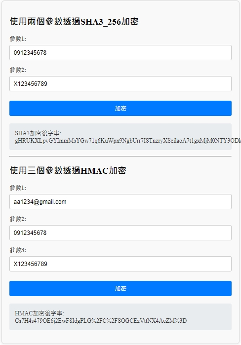

# 資料加密傳輸儲存系統

## 系統環境
* JDK 版本：Java 17
* 框架：Spring Boot v3.3.2
* 構建工具：Maven
* 前端技術：Vue3、Vue CLI v5.0.8
* Node.js 版本：v18.18.0

## 模組說明
此模組專為現代化系統製作，致力於提供靈活且強大的加密功能，保障敏感資訊的安全性。無論是資料的傳輸還是儲存，都依據最嚴格的安全標準進行防護。
模組內含兩大核心加密技術：Sha3_256 加密 與 HMAC 加密，並支持用戶需求進行客製化，滿足各種業務場景的資安需求。

1. 客製 Sha3_256 加密：
   該加密模組專為處理雙參數的敏感數據而設計，確保在傳輸過程中的數據完整性與私密性。
   通過 Sha3_256 演算法，結合加鹽(Salt)處理和 Base64 編碼，提供了高強度的加密方案。
    
   * 參數處理：首先對參數 2 執行字節流轉換，確保能夠進行進一步的加密操作。
   * 加鹽機制：再取得隨機鹽值，以防範暴力破解與字典攻擊或重複性攻擊，保證輸出結果的獨特性。
   * 加密流程：通過 Sha3-256 演算法，依次對兩個參數進行更新與加密操作，生成 32 字節的加密雜湊值。
   * 結果合併：將所有加密雜湊值合併後生成最終數據，並使用 Base64 進行編碼，最終得到可安全傳輸的加密字串。

   應用情境：
   * 身份驗證：可用於加密使用者的登入憑證（如帳號、密碼），確保資料庫中存儲的數據難以被直接還原。
   * 交易保護：在需要高安全性的金融交易中，Sha3_256 加密有助於保障交易過程的數據安全，防止未經授權的第三方攔截與篡改。
   
3. HMAC 加密：
   基於密鑰的訊息驗證碼是一種專門針對多參數設計的加密技術，HMAC的核心特點是允許使用固定密鑰對多個參數進行加密處理。
   並且具備高度靈活性，能夠根據業務需求進行擴展。其加密流程如下：

   * 參數封裝：將多個參數進行封裝，形成有序的參數集合，並確保其順序和內容的一致性。
   * 密鑰運算：根據密鑰與參數數據，計算出符合 RFC 2104 標準的 HMAC 值，確保數據的完整性。
   * 編碼與傳輸：加密結果以 Base64 格式進行編碼，並經過 URL 編碼處理，確保在網路傳輸中不會被篡改或損壞。
   
   HMAC 可靈活地應用於多個參數加密，並且支持額外的 Salt 機制，進一步增強加密的安全性。
   此技術特別適合於需要確保數據完整性和身份驗證的場景中，如 API 請求驗證。

   應用情境：
   * API 請求驗證：在 API 通訊中，客戶端可使用 HMAC 加密參數並隨請求一同傳遞，伺服端再進行 HMAC 計算以確認請求的真實性與完整性。
   * 數據驗證與簽名：HMAC 特別適合用於加密傳輸中的數據驗證，防止未經授權的數據篡改與重放攻擊。

## 運行環境
* API入口：EncryptController.java，處理加密請求的後端控制器
* 展示頁面：index.html，呈現加密結果的前端頁面
* 運行Server：內建 Spring Boot Tomcat 伺服器
* 預設Port：8080
* 啟動應用系統：執行 src/main/java/com/encrypt/Application.java
* 操作方式：打開瀏覽器，輸入 http://localhost:8080/ 操作
* 或是用JAR檔啟動:
   1. mvn clean package
   2. java -jar target/encrypt-0.0.1-SNAPSHOT.jar
   3. 即可至瀏覽器 http://localhost:8080/ 操作

## 範例結果

